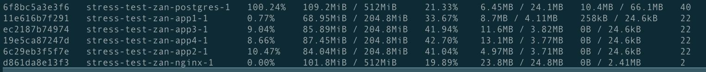

# Rinha BE 2023 - Q3 @luucaspole/@lukas8219

### Tecnologias usadas:

- Node
- Redis (vou meter ainda)
- Postgres

### WIP

Problema -  Banco gargalando - Reaching 100% > CPU usage com 1.0 CPU

1. Checar se é leitura ou escrita o problema
2. Adicionar Redis - Redis em batch?

WIP - Aperfeiçoar logica de batching ??

### Cache

Cache a nível de UNIQUE e de GET

### Tática:
Apenas fazer batch no client e rezar pro eventloop não morrer